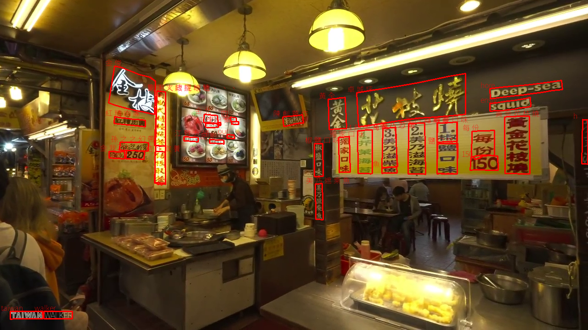
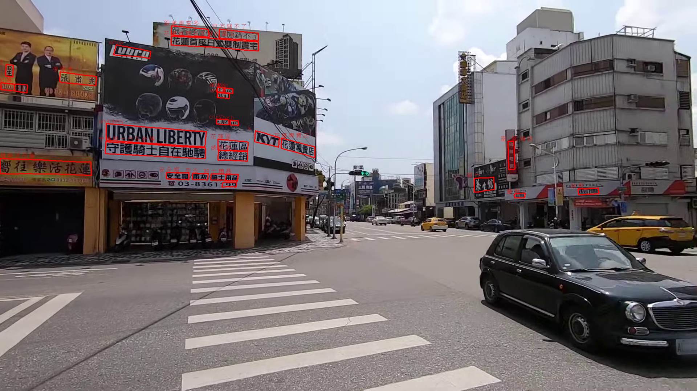

# NTU-AI-Scene-Text: Scene Text Detection and Recognition

- Detection Model : (AAAI24) SRFormer
- Recognition Model : (AAAI23) TROCR 

## Requirements

1. SRFormer

- Follow [SRFormer](https://github.com/retsuh-bqw/SRFormer-Text-Det) to install related package.

```
conda create -n SRFormer python=3.10 -y
conda activate SRFormer
pip install torch==1.13.1+cu116 torchvision==0.14.1+cu116 torchaudio==0.13.1 --extra-index-url https://download.pytorch.org/whl/cu116
pip install opencv-python scipy timm shapely albumentations Polygon3 pyclipper
python -m pip install 'git+https://github.com/facebookresearch/detectron2.git'
pip install setuptools==59.5.0

cd SRFormer-Text-Detection
python setup.py build develop
```

## Dataset

Please download following dataset, and place in 'datasets' folder. (please create datasets folder)

1. [D503](https://140.112.90.30:5001/sharing/pcwwGDeo7) 

2. [NTU Scene](https://140.112.90.30:5001/sharing/0jU1Rsthg)

Please organize your data as follow:
```
|-datasets
  |- D503 (we only use train and test data (w/o crop) here.)
    |- train
    |- val
    └─ test
  |- NTU
    └─ test
```

## Checkpoint

1. Download SRFormer ckeckpoint from [here](https://140.112.90.30:5001/sharing/MaSB5tXzr) and place in 'SRFormer-Text-Det/output/d503'

## SRFormer

1. (Option: for d503 dataset) Preprocessing training and test data
```
python ./utils/arrange_d503_poly_str_train.py
python ./utils/arrange_d503_poly_str_test.py
```

2. Finetune with d503 training set
```
cd SRFormer-Text-Det
CUDA_VISIBLE_DEVICES=0 python tools/train_net.py --config-file ./configs/SRFormer/d503/R_50_poly.yaml --num-gpus 1
```

3. Evaluation
```
cd SRFormer-Text-Det
CUDA_VISIBLE_DEVICES=0 python tools/train_net.py --config-file ./configs/SRFormer/d503/R_50_poly.yaml --num-gpus 1 --eval-only
```

4. Visualization
```
cd SRFormer-Text-Det
python demo/demo.py --config-file ./configs/SRFormer/d503/R_50_poly.yaml --input '../datasets/d503/test/images' --output './visualize/d503/' --opts MODEL.WEIGHTS './output/d503/model_final.pth'
```


## TrOCR

1. Preprocessing

```
python ./utils/srformer_trocr_transform.py  --source ./SRFormer-Text-Det/visualize/d503/tmp_result.json --target ./SRFormer-Text-Det/visualize/d503/trocr.json
```

2. Recognize

```
python predict.py --recog_model ycchen/TrOCR-base-ver021-v1 --source ./datasets/d503/test/images --save-conf --font ./utils/NotoSansTC-VariableFont_wght.ttf --output ./TrOCR/output --name d503 --nosave --detection_result ./SRFormer-Text-Det/visualize/d503/trocr.json
```

3. Visualize

```
python ./utils/redraw.py --image './datasets/d503/test/images' --label './TrOCR/output/d503/labels' --final "./d503"
```


## Result

- D503 Dataset



